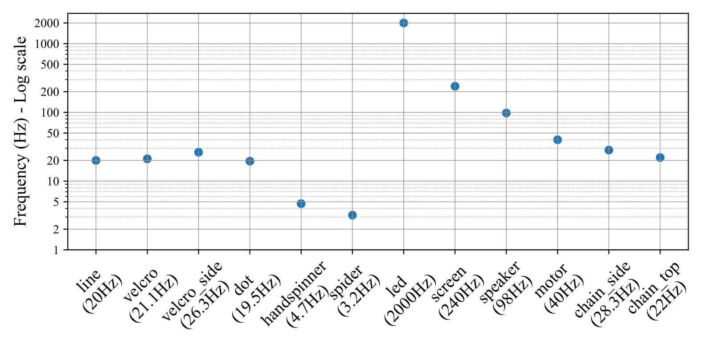

# EE3P3D

Repository under active development.

## Dataset
The dataset features 12 sequences of periodic phenomena (rotation - `01-06`, flicker - `07-08`, vibration - `09-10` and movement - `11-12`) with GT frequencies ranging from 3.2Hz up to 2000Hz in file formats `.raw` and `.hdf5`.

Data capture demonstration: [Youtube video](https://youtu.be/QlfQtvbaYy8)

Each event-based sequence was rendered as a video in 3 playback speeds: [Youtube playlist](https://www.youtube.com/playlist?list=PLK466i9CoYqQ2780OXJg7WgtUtWMEqbkS)

- [ ] Python script for easy sequence loading

## Method

## Usage
