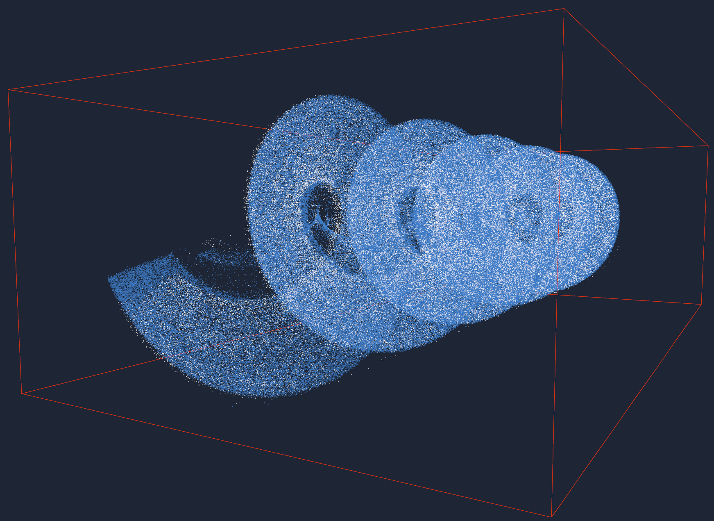
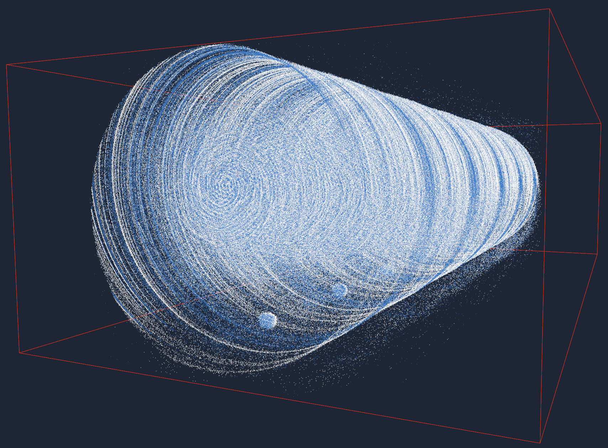
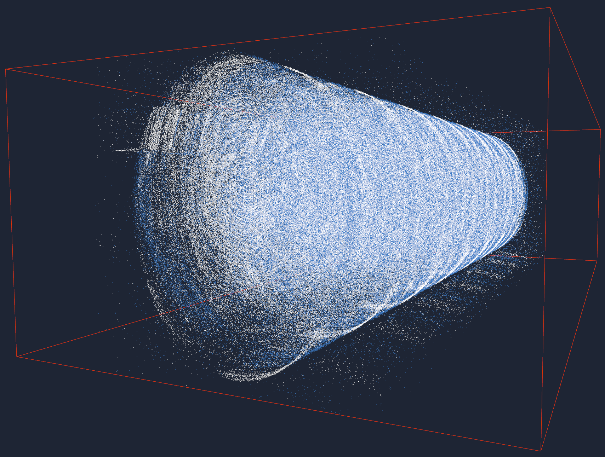
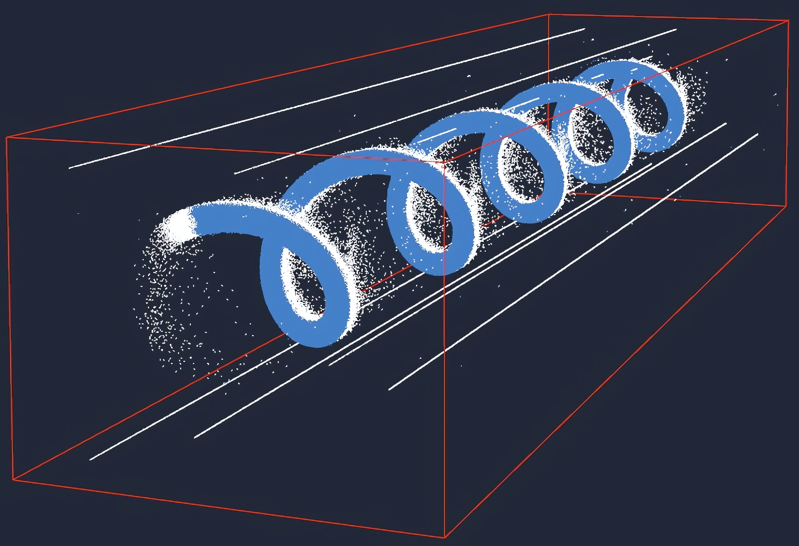
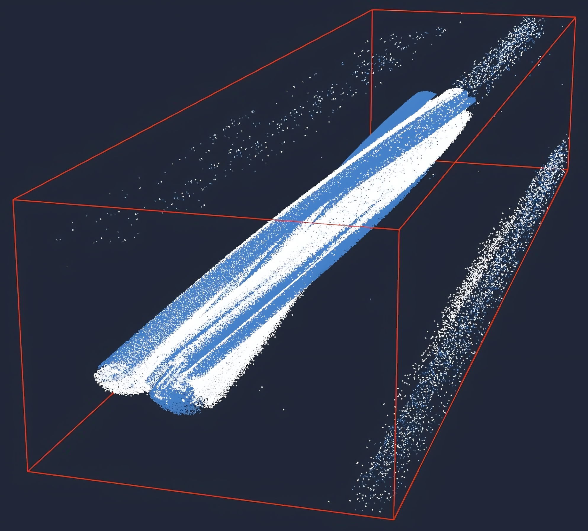
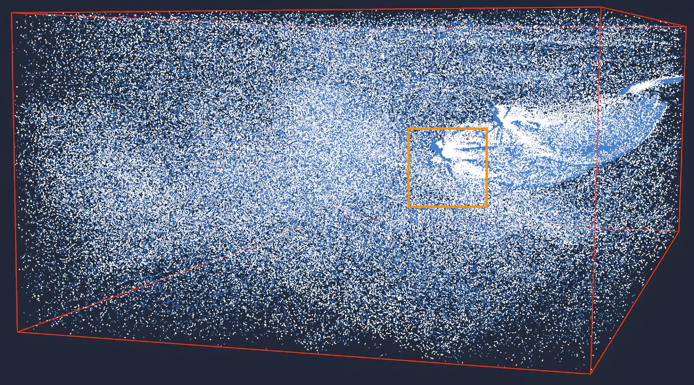
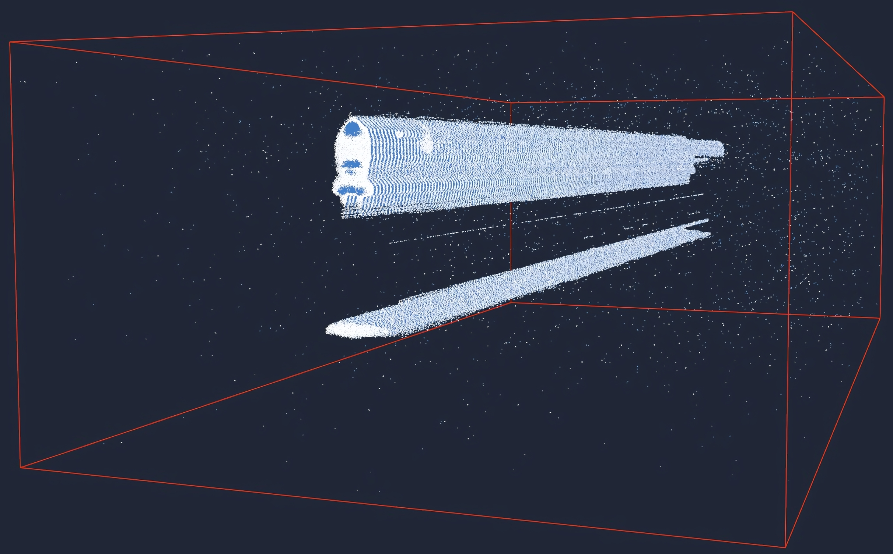
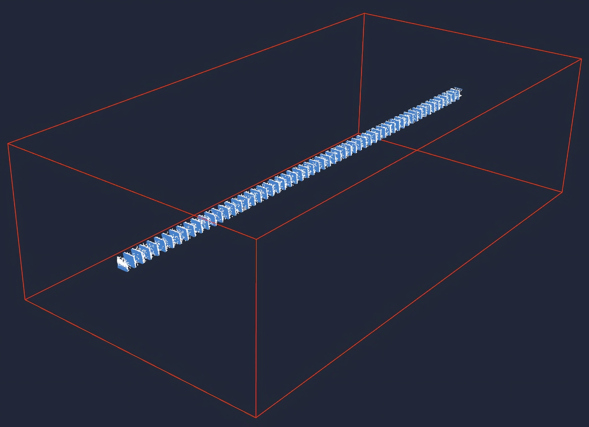
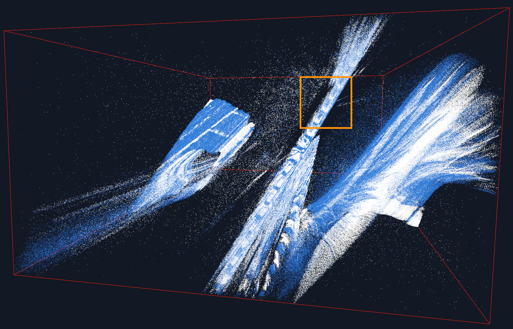

# PPED: Periodic Phenomena Event-based Dataset

The dataset features 12 one-second sequences of periodic phenomena (rotation - `01-06`, flicker - `07-08`, vibration - `09-10` and movement - `11-12`) with GT frequencies ranging from 3.2Hz up to 2000Hz in file formats `.raw` and `.hdf5`.

Data capture demonstration: [Youtube video](https://youtu.be/QlfQtvbaYy8)

Each event-based sequence was rendered as a video in 3 playback speeds: [Youtube playlist](https://www.youtube.com/playlist?list=PLK466i9CoYqQ2780OXJg7WgtUtWMEqbkS)

## Rotation
### 01 - High Contrast Line - 20Hz
Data visualised:
- at 0.06x playback (500 fps) - [link](https://www.youtube.com/watch?v=wIrkA8E9mU0)
- at 0.03x playback (1000 fps) - [link](https://www.youtube.com/watch?v=97ZCfkCUYow)
- at 0.006x playback (5000 fps) - [link](https://www.youtube.com/watch?v=g8umk0LYKbA)

A portion of the data visualised in XYTime space:

### 02 - Velcro (front view) - 21.1Hz
Data visualised:
- at 0.06x playback (500 fps) - [link](https://www.youtube.com/watch?v=LzZWIQTxicg)
- at 0.03x playback (1000 fps) - [link](https://www.youtube.com/watch?v=ZXUVfbVnecA)
- at 0.006x playback (5000 fps) - [link](https://www.youtube.com/watch?v=yIZIeimYJkg)

A portion of the data visualised in XYTime space:

### 03 - Velcro (side view) - 26.3Hz
Data visualised:
- at 0.06x playback (500 fps) - [link](https://www.youtube.com/watch?v=qwEI7vYnD_I)
- at 0.03x playback (1000 fps) - [link](https://www.youtube.com/watch?v=eJjkLXgL93k)
- at 0.006x playback (5000 fps) - [link](https://www.youtube.com/watch?v=C3gk-qhQhUc)

A portion of the data visualised in XYTime space:

### 04 - High Contrast Dot - 19.6Hz
Data visualised:
- at 0.06x playback (500 fps) - [link](https://www.youtube.com/watch?v=w60AZYyNgWk)
- at 0.03x playback (1000 fps) - [link](https://www.youtube.com/watch?v=sBFWObrqTRw)
- at 0.006x playback (5000 fps) - [link](https://www.youtube.com/watch?v=_X_kiPSN3eA)

A portion of the data visualised in XYTime space:

### 05 - Hand Spinner - 4.7Hz
Data visualised:
- at 0.3x playback (100 fps) - [link](https://www.youtube.com/watch?v=dQoZ3sYXSMk)
- at 0.06x playback (500 fps) - [link](https://www.youtube.com/watch?v=Ts-PXfplstc)
- at 0.03x playback (1000 fps) - [link](https://www.youtube.com/watch?v=XqCd8Bcq3yI)

A portion of the data visualised in XYTime space:

### 06 - Spider - 3.2Hz
Data visualised:
- at 0.3x playback (100 fps) - [link](https://www.youtube.com/watch?v=0fPIs3eReoo)
- at 0.06x playback (500 fps) - [link](https://www.youtube.com/watch?v=tfkJPhfbH0M)
- at 0.03x playback (1000 fps) - [link](https://www.youtube.com/watch?v=OHjNZRowd8g)

A portion of the data visualised in XYTime space:

## Flicker
### 07 - LED - 2000Hz
Data visualised:
- at 0.003x playback (10000 fps) - [link](https://www.youtube.com/watch?v=7oOmLMSd83w)
- at 0.0006x playback (50000 fps) - [link](https://www.youtube.com/watch?v=fQmqazVNV-E)
- at 0.0003x playback (100000 fps) - [link](https://www.youtube.com/watch?v=p2XcjC8q48U)

A portion of the data visualised in XYTime space:

### 08 - Screen - 240Hz
Data visualised:
- at 0.006x playback (5000 fps) - [link](https://www.youtube.com/watch?v=Jwgj10i3t7s)
- at 0.003x playback (10000 fps) - [link](https://www.youtube.com/watch?v=ozFZe9bQNm8)
- at 0.0006x playback (50000 fps) - [link](https://www.youtube.com/watch?v=aQpxOLzbDCo)

A portion of the data visualised in XYTime space:

## Vibration
### 09 - Speaker - 98Hz
Data visualised:
- at 0.06x playback (500 fps) - [link](https://www.youtube.com/watch?v=moU6-tnDoP8)
- at 0.03x playback (1000 fps) - [link](https://www.youtube.com/watch?v=Yna8W5JxCm4)
- at 0.006x playback (5000 fps) - [link](https://www.youtube.com/watch?v=yRzxBWj3Nyk)

A portion of the data visualised in XYTime space:

### 10 - Motor - 40Hz
Data visualised:
- at 0.3x playback (100 fps) - [link](https://www.youtube.com/watch?v=_Y2NPvgJ1TY)
- at 0.06x playback (500 fps) - [link](https://www.youtube.com/watch?v=bcsYxeoVlKQ)
- at 0.03x playback (1000 fps) - [link](https://www.youtube.com/watch?v=7YLkZ4aHVbg)

A portion of the data visualised in XYTime space:

## Movement
### 11 - Chain Side - 28.7Hz
Data visualised:
- at 0.3x playback (100 fps) - [link](https://www.youtube.com/watch?v=k2zHmqUwGGc)
- at 0.06x playback (500 fps) - [link](https://www.youtube.com/watch?v=Bc_3LB_H-SA)
- at 0.03x playback (1000 fps) - [link](https://www.youtube.com/watch?v=1NmrYGEQFLk)

A portion of the data visualised in XYTime space:

### 12 - Chain Top - 23Hz
Data visualised:
- at 0.3x playback (100 fps) - [link](https://www.youtube.com/watch?v=Yus5EU4jTvs)
- at 0.06x playback (500 fps) - [link](https://www.youtube.com/watch?v=k46kagKaVos)
- at 0.03x playback (1000 fps) - [link](https://www.youtube.com/watch?v=c8EY6fqjG6s)

A portion of the data visualised in XYTime space:

